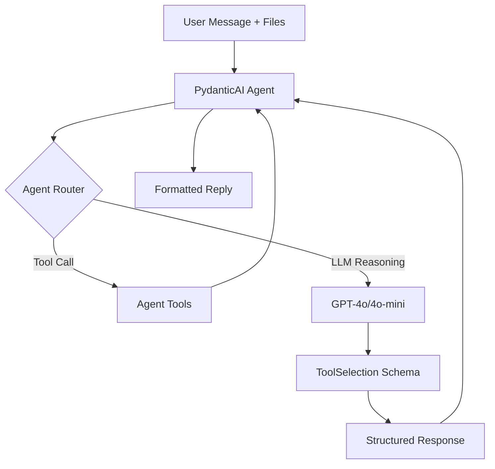

# Agent & VLM Selection

The second stage of the pipeline uses a vision-language model (VLM) with PydanticAI agents to select and rank the best tools from candidates.

## Overview

**Goal**: Select the most relevant tools using vision + text understanding

**Characteristics**:

- 🧠 Intelligent reasoning with explanations
- 👁️ Vision-aware (analyzes image content)
- 🎯 Comparative ranking of candidates
- 💬 Conversational with context
- 📊 Structured output (Pydantic schemas)

## Architecture



## PydanticAI Agent

### Agent Framework

**Framework**: [PydanticAI](https://ai.pydantic.dev/)

**Benefits**:

- Type-safe with Pydantic models
- Structured output validation
- Built-in tool support
- Async/await support
- Easy testing with dependency injection

### Agent Definition

```python
from pydantic_ai import Agent
from pydantic_ai.models.openai import OpenAIResponsesModel
from pydantic_ai.providers.openai import OpenAIProvider
from ai_agent.generator.prompts import get_agent_system_prompt
from ai_agent.generator.schema import ToolSelection
from ai_agent.agent.utils import AgentState

provider = OpenAIProvider(api_key=os.getenv("OPENAI_API_KEY"))
openai_model = OpenAIResponsesModel(model_name="gpt-4o-mini", provider=provider)

agent = Agent(
    model=openai_model,
    system_prompt=get_agent_system_prompt(num_choices=3),
    deps_type=AgentState,
)
```

**Key parameters**:

- `model`: VLM model to use (configurable via `config.yaml`)
- `system_prompt`: Agent role, scoring rules, and output format (from `generator/prompts.py`)
- `deps_type`: `AgentState` — tracks tool calls, quotas, and session overrides
- `output_type`: `ToolSelection` — passed to `agent.run_sync()` to enforce structured JSON output (not set on the `Agent` constructor)

### Conversation State

```python
from pydantic import BaseModel, Field
from typing import List, Optional, Dict, Any, Set

class AgentState(BaseModel):
    """Holds incremental tool call logs and runtime overrides."""
    
    tool_calls: List[Dict[str, Any]] = Field(default_factory=list)
    tool_counts: Dict[str, int] = Field(default_factory=dict)
    disabled_tools: Set[str] = Field(default_factory=set)
    excluded_tools: List[str] = Field(default_factory=list)
    
    # Runtime overrides (session-only)
    override_model: Optional[str] = None
    override_base_url: Optional[str] = None
    override_top_k: Optional[int] = None
    override_num_choices: Optional[int] = None
    
    image_paths: List[str] = Field(default_factory=list)
    original_formats: List[str] = Field(default_factory=list)
```

**Passed to every tool call** via dependency injection. Also carries per-tool call counts for quota enforcement.

## Agent Tools

Tools extend agent capabilities beyond chat:

### search_alternative

Request alternative search with different query formulation:

```python
@agent.tool(retries=2, prepare=cap_prepare)
@limit_tool_calls("search_alternative", cap=3)
async def search_alternative(
    ctx: RunContext[AgentState], 
    alternative_query: str,
    excluded: List[str] | None = None,
    top_k: int = 12,
) -> List[dict]:
    """Search for tools using an alternative query formulation."""
    
    inp = SearchAlternativeInput(
        alternative_query=alternative_query,
        excluded=excluded or [],
        top_k=top_k,
        original_formats=ctx.deps.original_formats,
        image_paths=ctx.deps.image_paths,
    )
    out = tool_search_alternative(inp)
    return [c.model_dump(mode="python") for c in out.candidates]
```

**Usage**:

- Agent invokes when user asks for alternatives
- Up to 3 calls per conversation
- Formulates semantically different queries

**Example**:
```
User: Show me alternatives
Agent: [Calls search_alternative with "pulmonary segmentation CT"]
```

### repo_info

Fetch GitHub repository details:

```python
@agent.tool(retries=2, prepare=cap_prepare)
@limit_tool_calls("repo_info", cap=12)
async def repo_info(ctx: RunContext[AgentState], url: str, tool_name: str | None = None) -> dict:
    """Fetch a short summary of a GitHub repository."""
    
    # Normalize to canonical GitHub URL
    norm_url = coerce_github_url_or_none(url)
    
    # Call tool_repo_summary (tries DeepWiki MCP first, falls back to repocards)
    out = await tool_repo_summary(RepoSummaryInput(url=norm_url, tool_name=tool_name))
    return out.model_dump(mode="python")
```

**Data sources**:

1. **DeepWiki MCP**: Pre-indexed, fast, no rate limits
2. **Repocards**: Direct fetch, fallback for new repos

**Returns**:

- Repository description
- Stars, language, topics
- Last update date
- License information

**Example**:
```
User: Tell me about TotalSegmentator
Agent: [Calls repo_info("https://github.com/wasserth/TotalSegmentator")]
      
      TotalSegmentator is an automated multi-organ segmentation tool...
      ⭐ 1.2k stars | Python | Apache-2.0 license
      Topics: segmentation, medical-imaging, deep-learning
```

### run_example

Execute Gradio Space demos (optional, experimental):

```python
@agent.tool(retries=0, prepare=cap_prepare)
@limit_tool_calls("run_example", cap=1)
async def run_example(
    ctx: RunContext[AgentState],
    tool_name: str,
    endpoint_url: str | None = None,
    extra_text: str | None = None,
) -> dict:
    """Run an example / demo for a given tool via its Gradio space."""
    
    out = tool_run_example(RunExampleInput(
        tool_name=tool_name,
        endpoint_url=endpoint_url,
        extra_text=extra_text,
    ))
    return out.model_dump(mode="python")
```

**Status**: Partially implemented, limited to specific demo formats.

## Selection and Ranking

The PydanticAI agent performs tool selection and ranking directly as part of its LLM reasoning step. There is no separate `VLMToolSelector` class — the agent's system prompt (defined in `generator/prompts.py`) encodes the scoring rules, and the `ToolSelection` Pydantic schema (defined in `generator/schema.py`) enforces structured output.

### System Prompt

The agent system prompt is assembled by `get_agent_system_prompt()` in `generator/prompts.py` and covers:

- **Image analysis**: Instructions to analyze the attached preview image and reference visual observations in explanations
- **Tool call sequence**: When to call `search_tools`, `search_alternative`, `repo_info`, and `run_example`
- **Scoring rules**: Accuracy (0–100) = Task match (40) + Format compatibility (30) + Features (30)
- **Output format**: Single JSON object matching the `ToolSelection` schema

```python
from ai_agent.generator.prompts import get_agent_system_prompt

# Generates a prompt that instructs the agent to return up to N ranked choices
system_prompt = get_agent_system_prompt(num_choices=3)
```

### Selection Process

#### Step 1: Tool Calls (Retrieval)

The agent calls `search_tools` once (and optionally `search_alternative` up to 3 times) to retrieve candidate tools from the vector index:

```
Agent → search_tools(query="segment lungs", top_k=12)
      ← [TotalSegmentator, MedSAM, nnU-Net, ...]
```

#### Step 2: Verification

For each finalist the agent plans to recommend, it calls `repo_info` to fetch up-to-date GitHub metadata:

```
Agent → repo_info(url="https://github.com/wasserth/TotalSegmentator")
      ← {stars: 1200, language: "Python", topics: [...], description: "..."}
```

#### Step 3: Structured Output

The agent returns one JSON object (no prose) that is validated against the `ToolSelection` schema:

```python
run_result = agent_instance.run_sync(
    user_prompt,       # text + optional BinaryContent image
    deps=deps,         # AgentState with image_paths, excluded_tools, etc.
    output_type=ToolSelection,
    usage_limits=UsageLimits(tool_calls_limit=20),
)
result = run_result.output  # ToolSelection instance
```

**Multimodal input**:

- Text: User task + hidden metadata (format hints, image dimensions)
- Image: PNG preview bytes passed as `BinaryContent(data=image_bytes, media_type="image/png")`
- Context: Conversation history prepended to the prompt

### Structured Response Schema

The `ToolSelection` Pydantic model (in `generator/schema.py`) validates the agent output:

```python
from ai_agent.generator.schema import (
    ToolSelection, ToolChoice, Conversation,
    ConversationStatus, NoToolReason
)

class ToolChoice(BaseModel):
    name: str
    rank: int
    accuracy: float          # 0-100
    why: str
    demo_link: Optional[str] = None

class Conversation(BaseModel):
    status: ConversationStatus
    question: Optional[str] = None   # required if status=needs_clarification
    context: Optional[str] = None    # required if status=needs_clarification
    options: Optional[List[str]] = None

class ToolSelection(BaseModel):
    conversation: Conversation
    choices: List[ToolChoice] = []
    explanation: Optional[str] = None
    reason: Optional[NoToolReason] = None
```

**Example response** (`ToolSelection`):
```json
{
  "conversation": {"status": "complete", "question": null, "context": null},
  "choices": [
    {
      "rank": 1,
      "name": "TotalSegmentator",
      "accuracy": 95.0,
      "why": "Specifically designed for automated multi-organ CT segmentation...",
      "demo_link": "https://huggingface.co/spaces/..."
    },
    {
      "rank": 2,
      "name": "MedSAM",
      "accuracy": 85.0,
      "why": "Flexible SAM-based segmentation supporting DICOM input...",
      "demo_link": "https://huggingface.co/spaces/..."
    }
  ],
  "explanation": null,
  "reason": null
}
```

### Validation

Pydantic validates:

- All required fields present
- Types correct (`int`, `float`, `str`, enum)
- `accuracy` within 0–100 range
- `ConversationStatus` is one of the allowed enum values
- `NoToolReason` is a valid enum value when `choices` is empty

`ToolSelection.normalize()` also enforces consistency rules automatically (e.g. setting `status=complete` when choices are returned, `status=needs_clarification` when a question is present).

## Conversation States

State machine for conversation flow:

```python
from ai_agent.generator.schema import ConversationStatus

class ConversationStatus(str, Enum):
    COMPLETE = "complete"                    # Recommendations provided (or no tool found)
    NEEDS_CLARIFICATION = "needs_clarification"  # Agent needs more info
```

### Complete

Normal successful response:

```python
{
    "conversation": {"status": "complete", "question": null, "context": null},
    "choices": [...],
    "explanation": null,
    "reason": null
}
```

**Triggers**: 

- Query is clear
- Candidates found
- Image/metadata sufficient

### Needs Clarification

Agent requests more information:

```python
{
    "conversation": {
        "status": "needs_clarification",
        "question": "Which specific organ would you like to segment?",
        "context": "Several segmentation tools available; target organ narrows choices.",
        "options": ["Lungs", "Brain", "Liver", "Other (briefly specify)"]
    },
    "choices": [],
    "explanation": null,
    "reason": null
}
```

**Triggers**:
- Ambiguous query
- Multiple valid interpretations
- Missing critical information

**Example flow**:
```
User: Segment this MRI
Agent: [STATUS: needs_clarification] Which organ would you like to segment?
User: The brain
Agent: [STATUS: complete] Here are brain segmentation tools...
```

### No Tool Terminal

No suitable tools in catalog — `status` is still `complete`, but `choices` is empty and a `reason` + `explanation` are provided:

```python
{
    "conversation": {"status": "complete", "question": null, "context": null},
    "choices": [],
    "reason": "no_task_match",
    "explanation": "No tools in the catalog handle audio processing. This catalog covers imaging analysis software."
}
```

Available `NoToolReason` values: `no_suitable_tool`, `no_modality_match`, `no_task_match`, `no_dimension_match`, `invalid_files`.

## Ranking Logic

### Scoring Factors

The agent considers:

#### High Priority
1. **Task Match**: Tool designed for this specific task
2. **Format Compatibility**: Supports user's file format
3. **Visual Analysis**: Image content matches tool's domain

#### Medium Priority
4. **Modality Alignment**: CT tool for CT image, MRI for MRI
5. **Dimension Match**: 3D tool for 3D volume
6. **Feature Coverage**: Specific capabilities mentioned

#### Low Priority  
7. **License**: Open-source preference (if no preference stated)
8. **Demo Availability**: Has runnable demo
9. **Popularity**: Community adoption

### Explanation Generation

Each recommendation includes explanation:

**Good explanation template**:
```
{Tool} is {specifically designed / well-suited} for {task} 
on {modality} images. It supports {format} input {with/without} 
preprocessing and provides {key features}. {Caveats if any}.
```

**Example**:
```
TotalSegmentator is specifically designed for automated multi-organ 
segmentation on CT scans. It supports DICOM input without preprocessing 
and can segment 104 anatomical structures including lungs, air airways, 
and vessels. It works best on whole-body CT but also performs well on 
thoracic scans.
```

### Rank Assignment

- **Rank 1**: Best overall match (highest accuracy score)
- **Rank 2**: Strong alternative or different approach
- **Rank 3**: Fallback option or specialized capability

**Important**: Ranks are relative to **this specific query**, not absolute tool quality.

## Model Configuration

### Model Selection

Available via `config.yaml`:

```yaml
agent_model:
  name: "gpt-4o-mini"
  base_url: null
  api_key_env: "OPENAI_API_KEY"
```

### Model Comparison

| Model | Vision | Speed | Cost | Best For |
|-------|--------|-------|------|----------|
| gpt-4o-mini | ✅ | ⚡⚡⚡ | $ | Most queries, fast iteration |
| gpt-4o | ✅✅ | ⚡⚡ | $$ | Complex visual analysis |
| gpt-5.1 | ✅✅✅ | ⚡ | $$$ | Maximum accuracy needed |

### Custom Endpoints

Support for OpenAI-compatible APIs:

```yaml
agent_model:
  name: "llama-3.2-vision"
  base_url: "https://inference.epfl.ch/v1"
  api_key_env: "EPFL_API_KEY"
```

## Error Handling

### Agent Errors

**Tool quota exceeded** (handled gracefully in `run_agent`):
```python
except UsageLimitExceeded:
    # Returns a ToolSelection with empty choices and an explanation
    result = ToolSelection(
        conversation=Conversation(status=ConversationStatus.COMPLETE, ...),
        choices=[],
        explanation="Tool call limit reached. Try a more specific query.",
    )
```

**Invalid structured output**:

PydanticAI automatically retries the LLM call (up to `retries=2` per tool) if the model returns output that fails `ToolSelection` validation. The `ToolSelection.normalize()` model validator also auto-corrects minor inconsistencies.

**API Errors**:
```python
except Exception as e:
    log.warning(f"Agent execution encountered an error: {e}")
    raise  # propagated to the UI layer
```

### Graceful Degradation

If the agent fails after all retries:

1. Return empty `choices` with an `explanation` describing what was searched
2. UI surfaces the explanation so users can refine their query
3. Suggest manual exploration of the catalog

<!-- ## Performance

### Latency

Typical VLM call: **2-5 seconds**

Breakdown:

- Prompt construction: <100ms
- API call: 2-4s (network + inference)
- Response parsing: <100ms
- Validation: <50ms

### Optimization

**Prompt optimization**:

- Concise candidate descriptions
- Limit to top-8 candidates
- Structured format for parsing

**Caching**:

- Model endpoint reused
- Agent instance persists across requests

**Batch processing** (for testing):
```python
# Process multiple queries
responses = await asyncio.gather(*[
    agent.run(query1),
    agent.run(query2),
    agent.run(query3)
])
``` -->

## Testing

### Unit Tests

Test agent selection with PydanticAI's built-in test model:

```python
from pydantic_ai import Agent
from pydantic_ai.models.test import TestModel
from ai_agent.generator.schema import ToolSelection, Conversation, ConversationStatus, ToolChoice
from ai_agent.agent.utils import AgentState

def test_agent_selection():
    test_model = TestModel()
    test_agent = Agent(model=test_model, deps_type=AgentState)
    
    mock_output = ToolSelection(
        conversation=Conversation(status=ConversationStatus.COMPLETE),
        choices=[
            ToolChoice(name="TotalSegmentator", rank=1, accuracy=95.0, why="Best CT segmenter")
        ]
    )
    
    with test_agent.override(model=test_model):
        result = test_agent.run_sync("segment lungs", deps=AgentState(), output_type=ToolSelection)
    
    assert result.output.conversation.status == ConversationStatus.COMPLETE
    assert len(result.output.choices) == 1
    assert result.output.choices[0].rank == 1
```

### Integration Tests

Test with real VLM (expensive, slow):

```python
@pytest.mark.integration
def test_real_agent():
    from ai_agent.agent.agent import run_agent
    
    with open("tests/data/sample.png", "rb") as f:
        image_bytes = f.read()
    
    result = run_agent(
        task="segment the lungs",
        image_paths=["tests/data/sample.dcm"],
        image_bytes=image_bytes,
    )
    
    assert result.conversation.status == ConversationStatus.COMPLETE
    assert len(result.choices) > 0
    assert all(0 <= c.accuracy <= 100 for c in result.choices)
```

## Next Steps

- Learn about [Software Catalog](catalog.md)
- Return to [Architecture Overview](overview.md)
- Explore [Retrieval Pipeline](retrieval.md)
