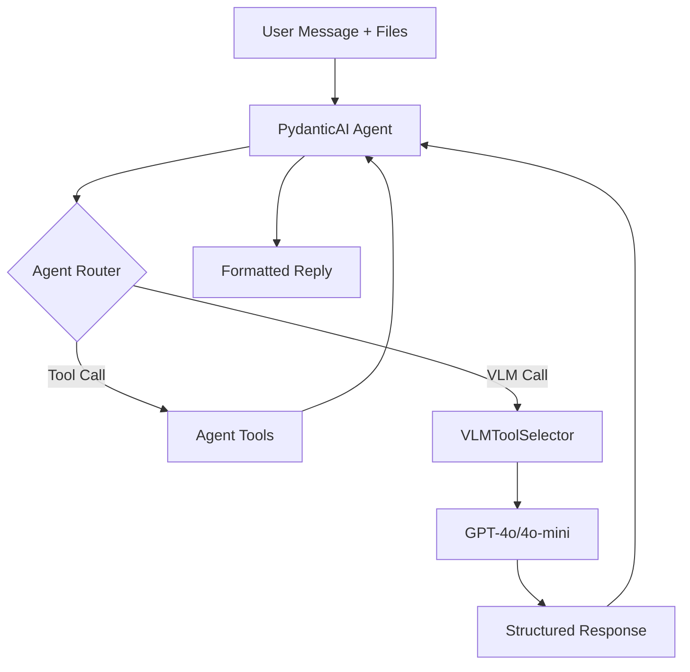

# Agent & VLM Selection

The second stage of the pipeline uses a vision-language model (VLM) with PydanticAI agents to select and rank the best tools from candidates.

## Overview

**Goal**: Select the most relevant tools using vision + text understanding

**Characteristics**:
- 🧠 Intelligent reasoning with explanations
- 👁️ Vision-aware (analyzes image content)
- 🎯 Comparative ranking of candidates
- 💬 Conversational with context
- 📊 Structured output (Pydantic schemas)

## Architecture



## PydanticAI Agent

### Agent Framework

**Framework**: [PydanticAI](https://ai.pydantic.dev/)

**Benefits**:
- Type-safe with Pydantic models
- Structured output validation
- Built-in tool support
- Async/await support
- Easy testing with dependency injection

### Agent Definition

```python
from pydantic_ai import Agent
from pydantic_ai.models.openai import OpenAIModel

agent = Agent(
    model=OpenAIModel("gpt-4o-mini"),
    system_prompt="""You are an expert assistant helping users find 
    imaging analysis software. You have access to a curated catalog 
    of tools and can recommend the best options based on user needs.""",
    deps_type=ChatState,
    result_type=str,
)
```

**Key parameters**:
- `model`: VLM model to use (configurable)
- `system_prompt`: Agent's role and behavior
- `deps_type`: Conversation state type
- `result_type`: Response format

### Conversation State

```python
from dataclasses import dataclass

@dataclass
class ChatState:
    """Maintains conversation context across turns."""
    
    conversation_turn: int = 0
    uploaded_files: list[str] = field(default_factory=list)
    excluded_tools: list[str] = field(default_factory=list)
    preview_images: list[str] = field(default_factory=list)
    last_recommendations: list[dict] = field(default_factory=list)
```

**Passed to every tool call** via dependency injection.

## Agent Tools

Tools extend agent capabilities beyond chat:

### search_alternative

Request alternative search with different query formulation:

```python
@agent.tool
async def search_alternative(
    ctx: RunContext[ChatState], 
    alternative_query: str
) -> str:
    """Search for tools using an alternative query formulation."""
    
    # Call retrieval pipeline with new query
    candidates = pipeline.retrieve(alternative_query)
    
    # Select with VLM
    recommendations = vlm_selector.select(
        query=alternative_query,
        candidates=candidates,
        images=ctx.deps.preview_images
    )
    
    return format_recommendations(recommendations)
```

**Usage**:
- Agent invokes when user asks for alternatives
- Up to 3 calls per conversation
- Formulates semantically different queries

**Example**:
```
User: Show me alternatives
Agent: [Calls search_alternative with "pulmonary segmentation CT"]
```

### repo_info

Fetch GitHub repository details:

```python
@agent.tool
async def repo_info(
    ctx: RunContext[ChatState],
    repo_url: str
) -> str:
    """Get detailed information about a GitHub repository."""
    
    # Try DeepWiki MCP first (fast, pre-indexed)
    try:
        info = await fetch_from_deepwiki(repo_url)
        return format_repo_info(info, source="deepwiki")
    except Exception:
        # Fallback to repocards library
        info = fetch_from_repocards(repo_url)
        return format_repo_info(info, source="repocards")
```

**Data sources**:
1. **DeepWiki MCP**: Pre-indexed, fast, no rate limits
2. **Repocards**: Direct fetch, fallback for new repos

**Returns**:
- Repository description
- Stars, language, topics
- Last update date
- License information

**Example**:
```
User: Tell me about TotalSegmentator
Agent: [Calls repo_info("https://github.com/wasserth/TotalSegmentator")]
      
      TotalSegmentator is an automated multi-organ segmentation tool...
      ⭐ 1.2k stars | Python | Apache-2.0 license
      Topics: segmentation, medical-imaging, deep-learning
```

### run_gradio_demo

Execute Gradio Space demos (future/experimental):

```python
@agent.tool
async def run_gradio_demo(
    ctx: RunContext[ChatState],
    space_url: str,
    tool_name: str
) -> str:
    """Execute a tool's Gradio Space demo on user's image."""
    
    # Upload image to Gradio Space
    # Configure parameters
    # Run inference
    # Download results
    
    return execution_result
```

**Status**: Partially implemented, limited to specific demo formats.

## VLMToolSelector

Core selection logic using vision-language models.

### Initialization

```python
from generator.generator import VLMToolSelector

selector = VLMToolSelector(
    model_name="gpt-4o-mini",
    base_url=None,  # Default OpenAI endpoint
    api_key=os.getenv("OPENAI_API_KEY")
)
```

### Selection Process

#### Step 1: Prompt Construction

**System Prompt**:
```
You are an expert imaging software consultant. Given a user query, 
an image, and candidate tools, select and rank the best 3 tools.

Consider:
- Task alignment
- Image content and characteristics  
- File format compatibility
- Modality support (CT, MRI, etc.)
- Dimension compatibility (2D, 3D)

Provide structured recommendations with explanations.
```

**User Prompt**:
```
User query: Segment the lungs

Image metadata:
- Format: DICOM
- Modality: CT
- Dimensions: 512x512x300 (3D)
- Spacing: 0.7x0.7x1.5 mm

Candidate tools:
1. TotalSegmentator
   Description: Automated multi-organ segmentation for CT
   Modalities: CT, MRI
   Formats: DICOM, NIfTI
   Dimensions: 3D
   
2. MedSAM
   Description: Medical image segmentation with SAM
   Modalities: CT, MRI, X-ray
   Formats: PNG, JPEG, DICOM
   Dimensions: 2D, 3D
   
[... more candidates ...]
```

**Image Attachment**:
- PNG preview of user's image
- Converted from DICOM/NIfTI/etc.
- Enables visual analysis

#### Step 2: VLM Call

```python
from pydantic_ai import Agent

response = await agent.run(
    user_prompt=user_prompt,
    message_history=conversation_history,
    files=[preview_image_path],
)
```

**Multimodal input**:
- Text: Query + metadata + candidates
- Image: Preview PNG
- Context: Conversation history

#### Step 3: Structured Response

VLM returns structured JSON matching Pydantic schema:

```python
from pydantic import BaseModel

class ToolRecommendation(BaseModel):
    rank: int
    name: str
    accuracy_score: int  # 0-100
    explanation: str
    reason: ToolReason
    demo_url: str | None

class AgentResponse(BaseModel):
    status: ConversationStatus
    recommendations: list[ToolRecommendation]
    message: str | None
```

**Example response**:
```json
{
  "status": "complete",
  "recommendations": [
    {
      "rank": 1,
      "name": "TotalSegmentator",
      "accuracy_score": 95,
      "explanation": "TotalSegmentator is specifically designed for...",
      "reason": "task_match",
      "demo_url": "https://huggingface.co/spaces/..."
    },
    {
      "rank": 2,
      "name": "MedSAM",
      "accuracy_score": 85,
      "explanation": "MedSAM provides flexible segmentation...",
      "reason": "format_match",
      "demo_url": "https://huggingface.co/spaces/..."
    },
    {
      "rank": 3,
      "name": "nnU-Net",
      "accuracy_score": 80,
      "explanation": "nnU-Net is a robust segmentation framework...",
      "reason": "general_capability",
      "demo_url": null
    }
  ],
  "message": null
}
```

### Validation

Pydantic validates:
- All required fields present
- Types correct (int, str, enum)
- Enums within allowed values
- Scores within 0-100 range

**If validation fails**: Request regeneration or use fallback format.

## Conversation States

State machine for conversation flow:

```python
from enum import Enum

class ConversationStatus(str, Enum):
    COMPLETE = "complete"              # Recommendations provided
    NEEDS_CLARIFICATION = "clarify"    # Agent needs more info
    NO_TOOL_TERMINAL = "no_tool"       # No suitable tools found
```

### Complete

Normal successful response:

```python
{
    "status": "complete",
    "recommendations": [...],
    "message": null
}
```

**Triggers**: 
- Query is clear
- Candidates found
- Image/metadata sufficient

### Needs Clarification

Agent requests more information:

```python
{
    "status": "clarify",
    "recommendations": [],
    "message": "I found several segmentation tools. Which specific organ would you like to segment?"
}
```

**Triggers**:
- Ambiguous query
- Multiple valid interpretations
- Missing critical information

**Example flow**:
```
User: Segment this MRI
Agent: [STATUS: clarify] Which organ would you like to segment?
User: The brain
Agent: [STATUS: complete] Here are brain segmentation tools...
```

### No Tool Terminal

No suitable tools in catalog:

```python
{
    "status": "no_tool",
    "recommendations": [],
    "message": "I couldn't find tools for audio processing in the imaging catalog."
}
```

**Triggers**:
- Task outside imaging domain
- Highly specialized need not in catalog
- All candidates filtered out

## Ranking Logic

### Scoring Factors

VLM considers:

#### High Priority
1. **Task Match**: Tool designed for this specific task
2. **Format Compatibility**: Supports user's file format
3. **Visual Analysis**: Image content matches tool's domain

#### Medium Priority
4. **Modality Alignment**: CT tool for CT image, MRI for MRI
5. **Dimension Match**: 3D tool for 3D volume
6. **Feature Coverage**: Specific capabilities mentioned

#### Low Priority  
7. **License**: Open-source preference (if no preference stated)
8. **Demo Availability**: Has runnable demo
9. **Popularity**: Community adoption

### Explanation Generation

Each recommendation includes explanation:

**Good explanation template**:
```
{Tool} is {specifically designed / well-suited} for {task} 
on {modality} images. It supports {format} input {with/without} 
preprocessing and provides {key features}. {Caveats if any}.
```

**Example**:
```
TotalSegmentator is specifically designed for automated multi-organ 
segmentation on CT scans. It supports DICOM input without preprocessing 
and can segment 104 anatomical structures including lungs, air airways, 
and vessels. It works best on whole-body CT but also performs well on 
thoracic scans.
```

### Rank Assignment

- **Rank 1**: Best overall match (highest accuracy score)
- **Rank 2**: Strong alternative or different approach
- **Rank 3**: Fallback option or specialized capability

**Important**: Ranks are relative to **this specific query**, not absolute tool quality.

## Model Configuration

### Model Selection

Available via `config.yaml`:

```yaml
agent_model:
  name: "gpt-4o-mini"
  base_url: null
  api_key_env: "OPENAI_API_KEY"
```

### Model Comparison

| Model | Vision | Speed | Cost | Best For |
|-------|--------|-------|------|----------|
| gpt-4o-mini | ✅ | ⚡⚡⚡ | $ | Most queries, fast iteration |
| gpt-4o | ✅✅ | ⚡⚡ | $$ | Complex visual analysis |
| gpt-5.1 | ✅✅✅ | ⚡ | $$$ | Maximum accuracy needed |

### Custom Endpoints

Support for OpenAI-compatible APIs:

```yaml
agent_model:
  name: "llama-3.2-vision"
  base_url: "https://inference.epfl.ch/v1"
  api_key_env: "EPFL_API_KEY"
```

## Error Handling

### VLM Errors

**Timeout**:
```python
try:
    response = await agent.run(prompt, timeout=30.0)
except TimeoutError:
    return fallback_response("VLM call timed out")
```

**Invalid Response**:
```python
try:
    validated = AgentResponse.model_validate(response)
except ValidationError:
    # Request regeneration with schema
    return retry_with_schema()
```

**API Errors**:
```python
except OpenAIError as e:
    log.error(f"OpenAI API error: {e}")
    return error_response("Service temporarily unavailable")
```

### Graceful Degradation

If VLM fails:
1. Return top retrieval candidates without ranking
2. Use retrieval scores as fallback
3. Provide generic explanations
4. Suggest manual exploration

## Performance

### Latency

Typical VLM call: **2-5 seconds**

Breakdown:
- Prompt construction: <100ms
- API call: 2-4s (network + inference)
- Response parsing: <100ms
- Validation: <50ms

### Optimization

**Prompt optimization**:
- Concise candidate descriptions
- Limit to top-8 candidates
- Structured format for parsing

**Caching**:
- Model endpoint reused
- Agent instance persists across requests

**Batch processing** (for testing):
```python
# Process multiple queries
responses = await asyncio.gather(*[
    agent.run(query1),
    agent.run(query2),
    agent.run(query3)
])
```

## Testing

### Unit Tests

Test VLM selection with mocked responses:

```python
def test_vlm_selection():
    selector = VLMToolSelector(model="test-mock")
    
    result = selector.select(
        query="segment lungs",
        candidates=mock_candidates,
        images=["test.png"]
    )
    
    assert result.status == "complete"
    assert len(result.recommendations) == 3
    assert result.recommendations[0].rank == 1
```

### Integration Tests

Test with real VLM (expensive, slow):

```python
@pytest.mark.integration
async def test_real_vlm():
    selector = VLMToolSelector(model="gpt-4o-mini")
    
    result = await selector.select_async(
        query="segment cat",
        candidates=real_candidates,
        images=["cat.jpg"]
    )
    
    assert "cat" in result.recommendations[0].explanation.lower()
```

## Next Steps

- Learn about [Software Catalog](catalog.md)
- Return to [Architecture Overview](overview.md)
- Explore [Retrieval Pipeline](retrieval.md)
