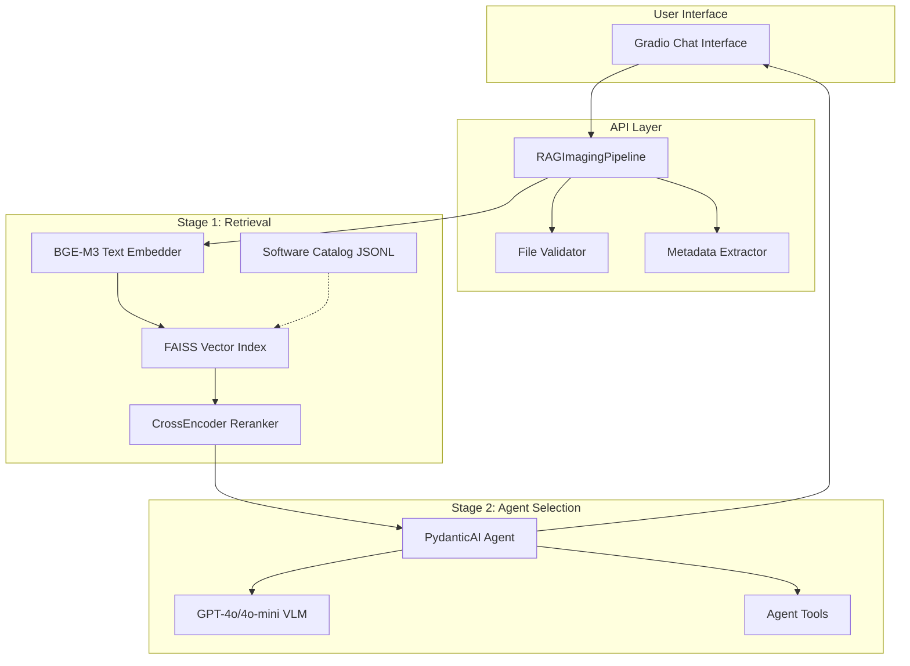

# Architecture Overview

The AI Imaging Agent uses a **two-stage pipeline** that combines fast text retrieval with vision-language model selection to recommend imaging tools.

## System Architecture



## Design Principles

### 1. Two-Stage Pipeline

**Why two stages?**

- **Speed**: Text retrieval is fast (~100ms), VLM calls are slower (~2-5s)
- **Cost**: Only run expensive VLM on top candidates
- **Quality**: Combine semantic search (Stage 1) with reasoning (Stage 2)

### 2. No Generation in Retrieval

Stage 1 uses **no LLMs**:

- Deterministic text search
- Reproducible results
- Fast iteration
- Lower cost

### 3. Single VLM Call in Selection

Stage 2 makes **exactly one VLM call**:

- Sees all candidates at once
- Performs comparative reasoning
- Returns complete rankings
- Efficient use of context window

### 4. Vision + Text Integration

VLM receives:

- **Visual**: PNG preview of image
- **Textual**: Query, metadata, candidate descriptions
- **Structured**: Candidate metadata table

Enables image-aware tool selection.

## Data Flow

### Input Processing

```
User uploads: scan.dcm
              "Segment the lungs"

↓ File Validation
  - Size check (< 200MB for DICOM)
  - Format validation
  - Security checks

↓ Metadata Extraction
  - Format: DICOM
  - Modality: CT
  - Dimensions: 512×512×300 (3D)
  - Spacing: 0.7×0.7×1.5mm

↓ Preview Generation
  - Extract middle slice: scan_preview.png
  - Format: PNG, RGB
  - Preserve metadata separately
```

### Stage 1: Retrieval

```
Query: "Segment the lungs"
Uploaded: scan.dcm (DICOM, CT, 3D)

↓ Query Enhancement
  Enhanced: "Segment the lungs format:DICOM format:CT format:3D"

↓ Metadata-Aware Hinting
  + image metadata summary (modality/anatomy/dims)

↓ Embedding (BGE-M3)
  Vector: [0.23, -0.15, 0.87, ..., 0.34]  # 1024 dims

↓ FAISS Search
  Top 20 candidates by cosine similarity

↓ Retry Broadening (if low results)
  retry with a shorter query formulation

↓ CrossEncoder Reranking
  Re-score with cross-attention
  Top 8 candidates

→ Candidates passed to Stage 2
```

### Stage 2: Agent Selection

```
Inputs:
  - User query: "Segment the lungs"
  - Image preview: scan_preview.png
  - Candidates: [tool1, tool2, ..., tool8]
  - Metadata: DICOM, CT, 3D, 512×512×300

↓ VLM Prompt Construction
  System: "You are an imaging tool expert..."
  User text: Query + metadata + candidate table
  User image: PNG preview

↓ VLM Call (GPT-4o)
  - Analyzes image content (CT thorax)
  - Reads candidate descriptions
  - Considers format compatibility
  - Reasons about task alignment

↓ Response (Structured)
  {
    "status": "complete",
    "recommendations": [
      {
        "rank": 1,
        "name": "TotalSegmentator",
        "accuracy": 95,
        "explanation": "...",
        "reason": "task_match"
      },
      ...
    ]
  }

→ Formatted recommendations to user
```

## Key Components

### api/pipeline.py

**RAGImagingPipeline**: Main orchestrator

```python
class RAGImagingPipeline:
    def __init__(self, catalog_path, index_dir):
        self.retriever = TextRetriever(...)
        # Stage 2 (selection/ranking) is handled by the PydanticAI agent
        # configured in generator/prompts.py using models from generator/schema.py
    
    def recommend(self, query, files):
        # Stage 1: Retrieval
        candidates = self.retriever.retrieve(query)
        
        # Stage 2: Selection via PydanticAI agent
        recommendations = run_selection_agent(
            query=query,
            candidates=candidates,
            files=files,
        )
        
        return recommendations
```

**Responsibilities**:

- File validation
- Metadata extraction
- Pipeline orchestration
- Error handling

### retriever/

**Text-based retrieval, no LLMs**

Components:

- `text_embedder.py`: BGE-M3 embedding model
- `vector_index.py`: FAISS index management
- `reranker.py`: CrossEncoder reranking
- `software_doc.py`: Catalog schema and loading

**Retrieval flow**:

1. Embed query → vector
2. FAISS search → top-N by similarity
3. CrossEncoder → rerank with cross-attention
4. Return top-K candidates

### generator/

**VLM-based tool selection building blocks**

Components:

- `schema.py`: Pydantic models for agent responses and tool recommendations
- `prompts.py`: System and tool-selection prompts used by the PydanticAI agent

**Selection logic**:

- Implemented in the PydanticAI agent (`agent/agent.py`) using these schemas and prompts
- Single VLM call with all candidates
- Structured output (Pydantic schemas) with ranked recommendations
- Vision + text multimodal input

### agent/

**PydanticAI conversational agent**

Components:

- `agent.py`: Agent definition and tools
- `state.py`: ChatState dataclass
- `tools.py`: Agent tools (search, repo_info, demo_exec)

**Tools**:

- `search_alternative`: Request alternative search
- `repo_info`: Fetch GitHub repository details
- `run_gradio_demo`: Execute Gradio Space demos

### utils/

**Shared utilities**

- `image_meta.py`: DICOM/NIfTI/TIFF metadata extraction
- `file_validator.py`: Size and format validation
- `previews.py`: Image conversion to PNG
- `tags.py`: Control tag parsing (`[EXCLUDE:...]`, etc.)
- `config.py`: Configuration management

### ui/

**Gradio interface**

Components:

- `app.py`: Gradio application
- `components.py`: Reusable UI components
- `handlers.py`: Message handlers
- `formatters.py`: Response formatting
- `visualizations.py`: Previews and traces

**Key function**:
```python
def respond(message: str, files: list, state: dict) -> tuple:
    """
    Main interaction function.
    
    Returns: (reply, media, updated_state)
    """
```

## Module Boundaries

Clear separation of concerns:

| Module | Purpose | Dependencies |
|--------|---------|--------------|
| `api/` | Pipeline orchestration | `retriever/`, `generator/`, `utils/` |
| `retriever/` | Text search only | None (pure retrieval) |
| `generator/` | VLM selection only | None (pure generation) |
| `agent/` | Conversational logic | `api/`, `utils/` |
| `ui/` | Interface only | `agent/`, `api/` |
| `utils/` | Shared functionality | None (pure utilities) |

**Benefits**:

- Independent testing
- Clear interfaces
- Modular replacement
- No circular dependencies

## Data Schemas

### Software Catalog

JSONL format, based on schema.org SoftwareSourceCode:

```json
{
  "name": "TotalSegmentator",
  "description": "Automated multi-organ segmentation...",
  "url": "https://github.com/wasserth/TotalSegmentator",
  "codeRepository": "https://github.com/wasserth/TotalSegmentator",
  "programmingLanguage": "Python",
  "license": "Apache-2.0",
  "keywords": ["segmentation", "medical-imaging", "CT"],
  "applicationCategory": "Medical Imaging",
  "operatingSystem": ["Linux", "Windows", "macOS"],
  "softwareRequirements": ["Python 3.9+", "PyTorch"],
  "supportingData": {
    "modalities": ["CT", "MRI"],
    "dimensions": ["3D"],
    "formats": ["DICOM", "NIfTI"],
    "tasks": ["segmentation"],
    "demo_url": "https://huggingface.co/spaces/..."
  }
}
```

### Agent Response

Pydantic models in `generator/schema.py`:

```python
class ToolRecommendation(BaseModel):
    rank: int
    name: str
    accuracy_score: int  # 0-100
    explanation: str
    reason: ToolReason  # Enum
    supporting_data: dict

class AgentResponse(BaseModel):
    status: ConversationStatus  # Enum
    recommendations: list[ToolRecommendation]
    message: str | None
```

**Validation**:

- Type checking via Pydantic
- Enum constraints
- Field aliases for LLM compatibility

## Extension Points

### Adding New Models

In `config.yaml`:

```yaml
available_models:
  - display_name: "Custom Model"
    name: "model-name"
    base_url: "https://api.example.com/v1"
    api_key_env: "CUSTOM_API_KEY"
```

### Adding New Tools

Add a tool in `agent/agent.py` and route implementation to `agent/tools/` modules:

```python
@agent.tool
async def new_tool(ctx: RunContext[AgentState], param: str) -> str:
  """Tool description for the agent."""
  # Delegate to ai_agent.agent.tools.* implementation
  return result
```

### Custom Metadata Extractors

In `utils/image_meta.py`:

```python
def extract_custom_format(file_path: str) -> dict:
    """Extract metadata from custom format."""
    # Implementation
    return metadata
```

<!-- ## Performance Characteristics

### Latency Breakdown

Typical request (~3-5 seconds total):

| Stage | Time | Notes |
|-------|------|-------|
| File upload | 100-500ms | Network + validation |
| Metadata extraction | 50-200ms | Format-dependent |
| Preview generation | 100-500ms | Image conversion |
| Retrieval (Stage 1) | 100-200ms | Embedding + FAISS |
| Reranking | 200-500ms | CrossEncoder |
| VLM call (Stage 2) | 2-4s | OpenAI API |
| Response formatting | 50ms | JSON → UI |

**Bottleneck**: VLM API call (Stage 2)

### Scalability

**Current**:

- Single-user Gradio app
- In-memory FAISS index
- Synchronous processing

**Production considerations**:

- FastAPI backend for multi-user
- Async VLM calls
- Redis for session state
- CDN for catalog + index -->

## Security Considerations

### User Data

- **Images**: Sent to OpenAI API (preview PNG) if gpt is selected
- **Metadata**: Processed locally, sent to VLM as text
- **Queries**: Sent to OpenAI API

**Privacy**: User data sees OpenAI's VLM API only.

### Catalog Integrity

- Software catalog is curated
- SHA1 checksums verify integrity
- No user-generated catalog entries

### Demo Execution

- Calls external Gradio Spaces (user choice)
- No credentials shared with demos
- User's image uploaded to public spaces (warn users)

## Next Steps

- Deep dive into [Retrieval Pipeline](retrieval.md)
- Learn about [Agent & VLM Selection](agent.md)
- Explore [Software Catalog](catalog.md)
