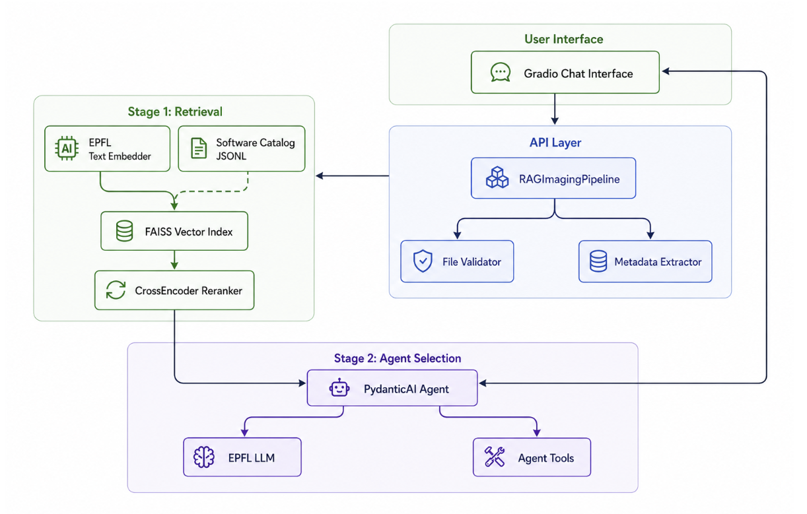

# Architecture Overview

AI Imaging Agent combines a React frontend, FastAPI service layer, PydanticAI conversational agent, and retrieval pipeline to recommend imaging tools.

## System Architecture



```text
React SPA
  auth, chat, assets, model controls, previews, volume rendering
        |
        | HTTP + SSE
        v
FastAPI Backend
  auth, files, chat, models, catalog, health, static SPA serving
        |
        v
Service Layer
  sessions, file ingestion, chat turn processing, volume views
        |
        v
PydanticAI Agent
  tool search, alternatives, repo info, demo actions
        |
        v
Retrieval Pipeline
  metadata, query hints, embeddings, FAISS, reranking
        |
        v
Software Catalog
  JSONL catalog, optional GraphDB sync, runnable examples
```

## Design Principles

### Two-Stage Recommendation

1. **Retrieval** finds likely catalog candidates quickly with embeddings, FAISS, and reranking.
2. **Agent/VLM selection** reasons over the user task, image preview, metadata, and candidates to produce ranked recommendations.

This keeps the expensive model call focused on a small candidate set.

### Service Boundary Between UI And Agent

The React app never runs retrieval or agent logic directly. It talks to FastAPI endpoints:

- `/api/auth/*` for passphrase auth
- `/api/files/*` for upload, previews, raw files, slices, MIPs, and volume bytes
- `/api/chat` for SSE chat turns
- `/api/models` for the model picker
- `/api/catalog/*` and `/api/healthz` for catalog/health support

### Metadata-Aware Retrieval

Uploads contribute format, modality, dimension, and compact metadata hints to retrieval. For example, a DICOM CT volume can add hints such as `format:DICOM`, `format:CT`, and `format:3D`.

### Graceful Degradation

If a preview or metadata extraction path fails, the system should continue with the information it has and report recoverable errors instead of crashing the chat turn.

## Data Flow

### Upload And Asset Registration

```text
User attaches file
        |
        v
POST /api/files
        |
        v
services.files.ingest_files()
  - validate file
  - extract metadata
  - build cached preview when possible
  - register asset in session
        |
        v
React receives asset_id, display name, format, metadata, preview URL
```

Volume assets can later be requested through `/api/files/asset/{asset_id}/view`, `/info`, `/volume`, or `/raw`.

### Chat Turn

```text
React sends message + asset IDs
        |
        v
POST /api/chat
        |
        v
SSE stream:
  session -> status beats -> text -> recommendations -> traces
  -> clarification/pending_action/images/files/usage -> done
        |
        v
services.chat.process_turn()
        |
        v
PydanticAI agent + retrieval tools
```

The current chat processing is synchronous underneath; the API emits heartbeat status events while it runs and then streams the finished result as named SSE events.

### Retrieval Stage

```text
User task + uploaded asset metadata
        |
        v
Control tags stripped and format hints added
        |
        v
Embed query
        |
        v
FAISS top-N search
        |
        v
Optional reranking
        |
        v
Top-K candidates
```

Retrieval makes no VLM calls.

### Agent Selection

The agent receives task context, candidate tools, image previews when available, and metadata summaries. It can:

- Return complete recommendations.
- Ask a clarification question.
- Search for alternatives.
- Fetch repository information.
- Propose or run supported demo actions.

## Key Components

### `src/frontend/`

React + Vite application.

Important pieces:

- `pages/ChatPage.tsx`: main chat workspace
- `pages/LoginPage.tsx`: passphrase login
- `components/ChatInput.tsx`: composer and upload flow
- `components/MessageList.tsx`: turn rendering
- `components/RecommendationCard.tsx`: recommendation UI
- `components/Volume3D.tsx`: Three.js volume rendering
- `hooks/useChat.tsx`: SSE chat state
- `hooks/useConversations.tsx`: local transcript persistence
- `lib/api.ts`: typed API wrapper
- `lib/sse.ts`: SSE client

### `src/ai_agent/api/`

FastAPI app and routers.

- `server.py`: app creation, CORS, static frontend serving
- `routers/auth.py`: login/logout/status
- `routers/chat.py`: SSE chat and pending-action endpoints
- `routers/files.py`: file upload and asset views
- `routers/models.py`: model list from `config.yaml`
- `deps.py`: auth and shared dependencies
- `schemas.py`: API models
- `pipeline.py`: retrieval pipeline orchestration

### `src/ai_agent/services/`

Service layer used by API routes.

- `sessions.py`: in-memory session and asset state
- `files.py`: upload ingestion and preview registration
- `chat.py`: chat turn orchestration and pending actions
- `views.py`: slices, MIPs, info, and volume bytes

### `src/ai_agent/agent/`

PydanticAI agent and tools.

- `agent.py`: agent definition and execution
- `models.py`: response/tool trace models
- `tools/search_tool.py`: primary catalog search
- `tools/search_alternative_tool.py`: alternative searches
- `tools/repo_info_tool.py` and `tools/deepwiki_tool.py`: repository context
- `tools/gradio_space_tool.py`: demo support
- `tools/mcp/`: MCP adapters

### `src/ai_agent/retriever/`

Retrieval stack.

- `text_embedder.py`: remote/local embeddings
- `vector_index.py`: FAISS index
- `reranker.py`: remote/local reranking
- `software_doc.py`: catalog document schema and loading

### `src/ai_agent/generator/`

Prompt and schema contracts for structured agent output.

### `src/ai_agent/ui/`

Legacy Gradio UI, launched with `ai_agent chat`. It remains useful as a fallback but is not the primary frontend.

## Module Boundaries

| Module | Purpose |
|--------|---------|
| `src/frontend/` | Client UI and browser interaction state |
| `api/` | HTTP/SSE surface, dependency wiring, request/response schemas |
| `services/` | Session, file, chat, and volume-view service logic |
| `agent/` | Conversational policy and tool orchestration |
| `retriever/` | Deterministic catalog retrieval |
| `generator/` | Prompt/schema contracts |
| `utils/` | Shared utilities |
| `catalog/` | GraphDB sync and catalog refresh |

## Deployment Modes

### Local Development

```bash
ai_agent serve

cd src/frontend
npm run dev
```

Open `http://localhost:5173`.

### Production / Docker

```bash
cd src/frontend
npm run build
cd ../..
ai_agent serve
```

If `FRONTEND_DIST_DIR` contains the built SPA, FastAPI serves the frontend and API from the same origin. The Dockerfile performs this build automatically and exposes port `7860`.

### Legacy UI

```bash
ai_agent chat
```

## Security Considerations

- `APP_PASSWORD` enables shared-passphrase auth with an httpOnly cookie.
- If `APP_PASSWORD` is unset, auth is disabled.
- Uploaded files are stored on the server under `UPLOAD_ROOT` or a temp directory.
- VLM calls can include image previews and metadata.
- External demos may receive user data only after the user chooses or approves that action.
- Prompt logging is local-only but can store sensitive previews/text when `LOG_PROMPTS=1`.

## Extension Points

### Add A Frontend Feature

Add UI components under `src/frontend/src/components`, route-level behavior under `pages`, and API calls under `lib/api.ts` or `lib/sse.ts`.

### Add An API Endpoint

Add a router under `src/ai_agent/api/routers`, shared schemas in `schemas.py`, and reusable logic in `services/` when stateful or cross-route.

### Add A Tool

Implement tool behavior under `src/ai_agent/agent/tools/` and register it through the agent/tool registry pattern already used in `agent.py`.

### Add A Metadata Extractor

Extend `utils/image_meta.py` and ensure preview behavior remains graceful for unsupported files.

## Next Steps

- Deep dive into [Retrieval Pipeline](retrieval.md)
- Learn about [Agent & VLM Selection](agent.md)
- Review the [Project Guide](../guide.md)
