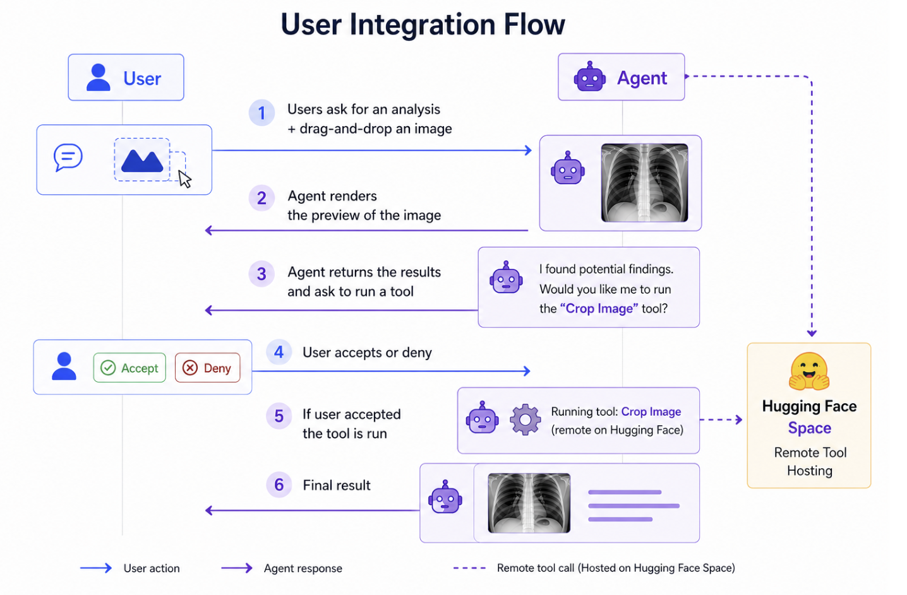

# AI Imaging Agent

**AI Imaging Agent**, also known as **Imaging Plaza**, is a conversational RAG + AI agent system for discovering imaging software. Upload an image or volume, describe the task, and receive ranked recommendations with explanations, compatibility metadata, and runnable demo links.

[](https://www.python.org/downloads/)
[](https://github.com/imaging-plaza/ai-agent/blob/main/LICENSE)

## Key Features

- **React chat interface** with local conversation history, queued follow-ups, examples, model controls, theme toggle, and inline media.
- **FastAPI backend** with password auth, SSE chat events, file/session APIs, model discovery, and production SPA serving.
- **Smart retrieval** using remote or local embedding models, FAISS search, and optional reranking.
- **Vision-aware agent selection** that considers the uploaded preview, original metadata, user task, and candidate catalog entries.
- **Medical/scientific imaging support** for DICOM, NIfTI, TIFF stacks, CT, MRI, microscopy, and standard image formats.
- **Volume-aware asset tools** including previews, slices, MIPs, raw file serving, and browser-side 3D rendering.
- **Demo workflows** for runnable examples such as Hugging Face Gradio Spaces.

## Quick Example

Run the backend:

```bash
ai_agent serve
```

Run the frontend in another terminal:

```bash
cd src/frontend
npm run dev
```

Then open `http://localhost:5173`, upload an image or volume, and ask:

```text
I want to segment the lungs from this CT scan
```

For production, build the frontend with `npm run build`; `ai_agent serve` will serve the built React bundle when `src/frontend/dist` exists.

## How It Works



The system uses four cooperating layers:

1. **React SPA** handles chat, assets, conversation history, model settings, and previews.
2. **FastAPI service** authenticates users, stores session assets, streams chat events, and serves files/views.
3. **PydanticAI agent** orchestrates catalog search, alternatives, repository lookup, and demo actions.
4. **Retrieval pipeline** builds metadata-aware queries, searches FAISS, reranks candidates, and passes them to the agent.

Learn more in the [Architecture Overview](architecture/overview.md).

## Use Cases

### Medical Imaging

- Segment organs from CT/MRI scans
- Register brain images
- Analyze DICOM files and 3D volumes
- Compare tools by modality, dimension, format, and license

### Scientific Imaging

- Process microscopy images
- Analyze multidimensional TIFF stacks
- Find tools for denoising, segmentation, enhancement, or measurement

### General Computer Vision

- Object detection and segmentation
- Image classification
- OCR and text extraction
- Image restoration and enhancement

## Getting Started

Start with the [Installation Guide](getting-started/installation.md), then follow the [Quick Start](getting-started/quickstart.md).

For maintainers and contributors, see the [Project Guide](guide.md).

## Project Status

This project is actively developed by the Imaging Plaza team. See the [Changelog](reference/changelog.md) for recent updates.

## License

This project is licensed under the Apache 2.0 License. See the [LICENSE](https://github.com/imaging-plaza/ai-agent/blob/main/LICENSE) file for details.
