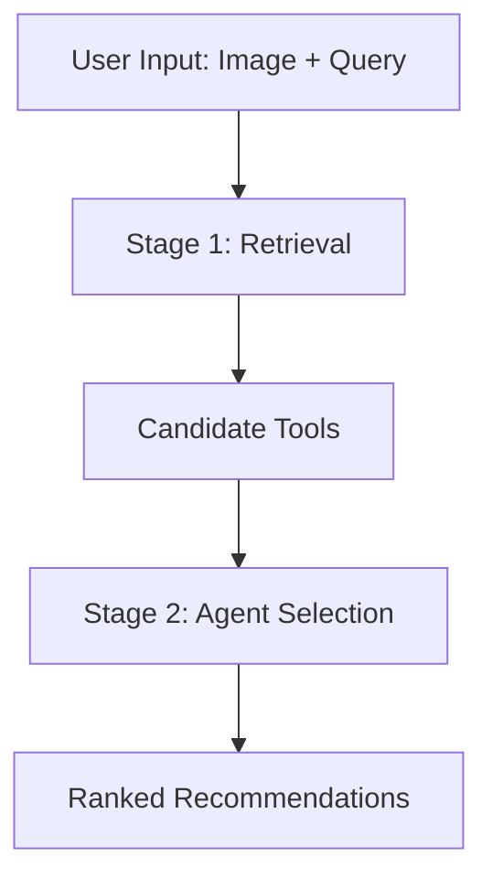

# Understanding Recommendations

The AI Imaging Agent uses a sophisticated two-stage pipeline to provide ranked tool recommendations. This guide explains how recommendations are generated and how to interpret them.

## How Recommendations Work

### Two-Stage Pipeline



#### Stage 1: Retrieval (Fast Text Search)

The retrieval stage quickly narrows down candidates:

1. **Query Enhancement**: Your query is enriched with format tokens
   ```
   Original: "segment lungs"
   Enhanced: "segment lungs format:DICOM format:CT format:3D"
   ```

2. **Embedding Search**: BGE-M3 model converts query to vector
3. **FAISS Vector Search**: Finds semantically similar tools
4. **CrossEncoder Reranking**: Re-scores candidates for better relevance
5. **Result**: Top-K candidates (default: 8)

**No LLM calls** - this stage is fast and deterministic.

#### Stage 2: Agent Selection (VLM-Powered)

The agent analyzes candidates with full context:

1. **Vision Analysis (only for VLM)**: GPT-4o/4o-mini (or your custom model) sees your image preview
2. **Context Integration**: Considers query + metadata + candidates
3. **Reasoning**: Explains why each tool matches
4. **Scoring**: Assigns accuracy scores (0-100%)
5. **Ranking**: Orders tools by relevance

**Single VLM call** - comprehensive analysis with explanations.

## Recommendation Format

Each recommendation includes several components:

### Header Information

#### Rank Number
Position in the ranked list (1 = best match).

```
1️⃣ TotalSegmentator
2️⃣ MedSAM
3️⃣ nnU-Net
```

#### Tool Name
The software or tool identifier, typically matching:
- GitHub repository name
- Published tool name
- Common community name

#### Accuracy Score
Confidence level from 0-100%:

- **90-100%**: Excellent match, highly confident
- **70-89%**: Good match, suitable for task
- **50-69%**: Moderate match, may need adaptation
- **Below 50%**: Weak match, alternative approach

!!! note "Score Interpretation"
    Scores reflect match quality for **your specific task and image**, not overall tool quality.

### Body Content

#### Description
Brief explanation of what the tool does:

```
TotalSegmentator: Automated multi-organ segmentation for CT scans supporting 104 anatomical structures.
```

#### Explanation
Why this tool matches your request:

```
Explanation: TotalSegmentator is specifically designed for whole-body CT segmentation including lung structures. It supports DICOM input and provides automated, accurate lung segmentation without manual intervention.
```

Key points in explanations:

- **Task Alignment**: How well it matches your goal
- **Format Compatibility**: Support for your file format
- **Relevant Features**: Specific capabilities that help
- **Known Limitations**: Caveats or requirements

#### Demo Link
Direct link to a runnable example:

```
🚀 Demo: https://huggingface.co/spaces/example/totalsegmentator
```

Types of demos:

- **HuggingFace Spaces**: Interactive Gradio/Streamlit apps
- **Colab Notebooks**: Jupyter notebooks you can run
- **Web Demos**: Hosted web interfaces
- **Documentation**: GitHub README with examples

### Metadata Footer

Technical details about the tool:

#### Modality Support
Medical imaging modalities the tool works with:

```
Modalities: CT, MRI, X-ray
```

Common modalities:

- **CT**: Computed Tomography
- **MRI**: Magnetic Resonance Imaging
- **XR**: X-ray radiography
- **US**: Ultrasound
- **PET**: Positron Emission Tomography
- **OCT**: Optical Coherence Tomography
- **Microscopy**: Various microscopy types

#### Dimension Support
Image/volume dimensions supported:

```
Dimensions: 2D, 3D
```

- **2D**: Single slice images
- **3D**: Volumetric data
- **4D**: Time-series volumes

#### Format Support
File formats the tool can process:

```
Formats: DICOM, NIfTI, PNG, JPEG
```

!!! tip "Format Importance"
    Tools that support your **exact format** are prioritized in ranking.

#### Tags
Categorization and keywords:

```
Tags: segmentation, medical-imaging, deep-learning, pytorch
```

Used for:
- Task categorization
- Technology stack
- Domain specificity
- Feature indicators

## Scoring Factors

The agent considers multiple factors when scoring:

### Primary Factors (High Weight)

1. **Task Match**: How well the tool's purpose aligns with your request
2. **Format Compatibility**: Support for your input format
3. **Image Content**: Visual analysis of what's in your image
4. **Dimension Match**: 2D tool for 2D images, 3D for volumes

### Secondary Factors (Medium Weight)

5. **Modality Specificity**: Tool designed for your imaging modality
6. **Feature Coverage**: Breadth of capabilities
7. **Stated Requirements**: Meets any specific requirements you mentioned
8. **Quality Indicators**: Stars, citations, community adoption

### Tertiary Factors (Low Weight)

9. **License**: Open-source vs. proprietary
10. **Recency**: Recently updated tools
11. **Documentation Quality**: Demo availability, examples
12. **Popularity**: Community usage and validation

## Interpreting Results

### High-Scoring Recommendations

When you see scores above 85%:

✅ **Strong match** - Tool is designed for this task
✅ **Format compatible** - Handles your file type
✅ **Proven capability** - Demonstrated results in this domain

**Action**: These are your best options. Try the top recommendation first.

### Medium-Scoring Recommendations

Scores 60-85%:

⚠️ **Good match** - Suitable but may need adaptation
⚠️ **Possible format conversion** - Might require preprocessing
⚠️ **Partial capability** - Covers some but not all requirements

**Action**: Worth trying, especially if top choices don't work. Read explanations carefully.

### Low-Scoring Recommendations

Scores below 60%:

❌ **Weak match** - Limited alignment with task
❌ **Format issues** - May not support your format
❌ **Alternative approach** - Different methodology

**Action**: Consider as fallback or for exploring alternative approaches.

## Why Rankings Change

Rankings depend on your specific context:

### Same Tool, Different Queries

"Segment lungs" vs "Detect tumors":
- Different tools excel at each task
- Rankings change based on task specificity

### Same Task, Different Formats

DICOM input vs PNG input:
- DICOM-compatible tools rank higher for DICOM
- General tools rank higher for standard images

### Same Task, Different Images

CT scan vs X-ray:
- Modality-specific tools get boosted
- Visual content influences selection

## Common Patterns

### All High Scores
Most recommendations >80%:

- **Good news!** Multiple excellent options
- **Strategy**: Try top recommendation, then compare

### Mixed Scores
Wide range (e.g., 90%, 65%, 45%):

- **Top choice clear** - Focus on highest scorer
- **Strategy**: Try #1, fall back to #2 if needed

### All Low Scores
All recommendations <60%:

- **Limited options** - Task may be specialized
- **Strategy**: Try anyway, or rephrase query
- **Alternative**: Ask for suggestions

## Acting on Recommendations

### First Time with a Tool

1. **Read the explanation** - Understand why it was recommended
2. **Check format compatibility** - Verify it supports your format
3. **Click demo link** - See it in action
4. **Try on your data** - Run if agent offers

### Comparing Tools

When choosing between similar scores:

- **Check licenses** if redistribution matters
- **Compare formats** - prefer exact format match
- **Review tags** - match technology preferences
- **Demo availability** - easier to try

### When Results Don't Match

If recommendations seem wrong:

1. **Provide more context**: "I need 3D volume support"
2. **Mention specific requirements**: "Must work with DICOM"
3. **Exclude irrelevant tools**: `[EXCLUDE:toolname]`
4. **Request alternatives**: "Can you search differently?"

## Explanation Analysis

Read explanations to understand:

### Positive Indicators

Look for phrases like:
- "Specifically designed for..."
- "Supports your exact format..."
- "Demonstrated accuracy on..."
- "Active development and maintained"

### Caveats

Watch for:
- "May require preprocessing..."
- "Limited to 2D images..."
- "Experimental feature..."
- "Requires specific environment..."

### Requirements

Note when explanations mention:
- "Needs GPU for inference"
- "Requires Python 3.8+"
- "DICOM headers must include..."
- "Minimum image resolution..."

## Next Steps

- Learn about [Running Demos](running-demos.md)
- Explore [Advanced Features](advanced-features.md)
- Understand the [Architecture Overview](../architecture/overview.md)
